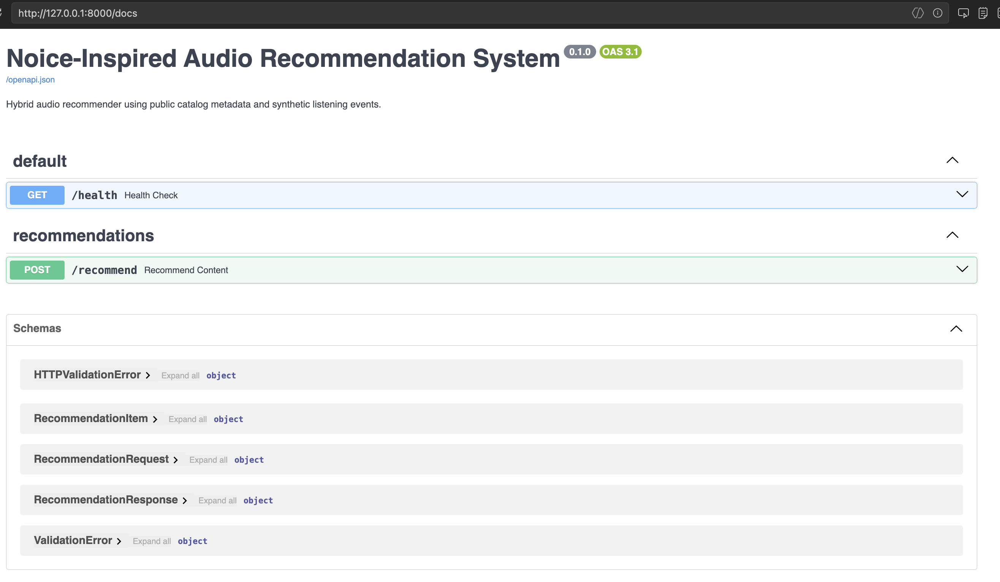

# 🎧 Noice-Inspired Audio Content Recommendation System


A hybrid audio recommendation system inspired by Indonesian audio platforms such as Noice. The project combines item-based collaborative filtering, TF-IDF content similarity, implicit feedback scoring, popularity fallback, model persistence, Docker, GitHub Actions CI, and FastAPI serving.

This project uses public catalog-style metadata and synthetic listening events for portfolio and educational purposes. It does not use private, internal, or personally identifiable Noice user data.

> **Data disclaimer:** This project does not use private or internal Noice user data. It uses publicly observable content metadata and synthetic listening events for portfolio and educational purposes. It is not an official Noice API, integration, or internal dataset.

## 💡 Why I Built This

I built this project to simulate how an audio streaming platform such as Noice could recommend podcasts, audio series, radio shows, films, and premium content based on user listening behavior.

Because real user listening logs are not publicly available, this project uses public catalog-style metadata and synthetic interaction events. The goal is not to claim production-level recommendation accuracy, but to demonstrate an end-to-end recommendation pipeline: data processing, implicit feedback scoring, hybrid ranking, evaluation, model persistence, and API serving.

## 📌 Project Summary

The system simulates a realistic audio recommendation workflow:

- Reads public content catalog-style metadata from `data/raw/content.csv`
- Reads synthetic user listening events from `data/raw/interactions.csv`
- Converts listening behavior into implicit feedback scores
- Trains a hybrid recommender using item-based collaborative filtering and TF-IDF content similarity
- Persists the trained recommender to `models/hybrid_recommender.pkl`
- Serves personalized and cold-start recommendations through FastAPI

## 🛡️ Data Disclaimer

This project is Noice-inspired and built for portfolio and educational purposes. It does not use private, internal, login-protected, or personally identifiable Noice user data. Content metadata is based on publicly observable catalog-style information, while listening interactions are synthetic simulations.

See [`DATA_DISCLAIMER.md`](DATA_DISCLAIMER.md) for the full data and affiliation disclaimer.

## 🗂️ Project Structure

```text
content-recommendation-system/
├── data/
│   ├── raw/content.csv
│   ├── raw/interactions.csv
│   └── processed/
├── models/hybrid_recommender.pkl
├── src/
│   ├── data_pipeline.py
│   ├── recommender.py
│   ├── evaluate.py
│   └── utils.py
├── api/
│   ├── main.py
│   ├── schemas.py
│   ├── services/recommender_service.py
│   └── routers/recommend.py
├── experiments/experiment_log.md
├── Dockerfile
├── requirements.txt
└── README.md
```

## 🧾 Dataset Schema

### `data/raw/content.csv`

Public catalog-style content metadata for demo/portfolio purposes.

| Column | Description | Example |
|---|---|---|
| `content_id` | Unique content identifier | `c_001` |
| `show_name` | Parent show/program name | `Musuh Masyarakat` |
| `title` | Episode/content title | `E173: Kami Mendukung Skincare Abal-Abal!` |
| `content_type` | Audio content format | `podcast`, `audiobook`, `radio` |
| `genre` | Main genre/category | `komedi`, `horror` |
| `tags` | Search/recommendation keywords | `komedi satire masyarakat sosial` |
| `duration_seconds` | Content duration | `3720` |
| `is_premium` | Premium/VIP flag | `True` |
| `tier` | Access tier | `free`, `premium`, `vip` |

### `data/raw/interactions.csv`

Synthetic listening behavior from simulated users.

| Column | Description | Example |
|---|---|---|
| `user_id` | Synthetic user identifier | `u_010` |
| `content_id` | Content identifier | `c_025` |
| `event_type` | Listening event | `play`, `skip`, `like`, `complete`, `replay`, `share`, `follow_show` |
| `listen_duration_sec` | Seconds listened | `2237` |
| `content_duration_sec` | Full content duration | `4020` |
| `completion_rate` | Listen completion ratio | `0.5565` |
| `timestamp` | Synthetic event timestamp | `2025-12-12 20:48:10` |
| `device` | Simulated device | `android`, `ios`, `web` |
| `source` | Simulated discovery source | `home`, `search`, `detail_page`, `share_link` |

## 🔄 Data Pipeline

Run:

```bash
python3 src/data_pipeline.py
```

The pipeline validates schemas, normalizes types, parses timestamps, cleans text fields, merges content metadata, and writes:

- `data/processed/content_processed.csv`
- `data/processed/interactions_processed.csv`
- `data/processed/user_item_matrix.csv`
- `data/processed/training_events.csv`

Derived features include:

- `implicit_score`
- `listen_hour`
- `is_night_listener`
- `duration_minutes`
- `completion_bucket`
- `content_text`

## 🧠 Implicit Feedback Scoring

Because the dataset uses listening events instead of direct ratings, each event is converted into an implicit preference score.

```text
implicit_score = event_weight
               + 3.0 * completion_rate
               + source_bonus
               + device_bonus
```

Event weights:

| Event | Weight |
|---|---:|
| `skip` | -1.0 |
| `play` | 1.0 |
| `like` | 4.0 |
| `complete` | 4.5 |
| `replay` | 5.0 |
| `share` | 4.0 |
| `follow_show` | 5.0 |

Bonuses:

- `+0.5` if source is `detail_page` or `search`
- `+0.3` if device is `android` or `ios`
- Final score is clamped to minimum `0`

## 🤖 Hybrid Recommendation Model

The recommender blends two signals:

1. **Item-based collaborative filtering** from the user-item implicit feedback matrix
2. **Content-based similarity** from TF-IDF over `content_text`

Formula:

```text
final_score = alpha * collaborative_score + (1 - alpha) * content_score
alpha = 0.6
```

`alpha = 0.6` gives slightly more weight to listening behavior, while the content model keeps recommendations useful when interaction data is sparse.

Supported model methods:

- `recommend_for_user(user_id, top_k=10)`
- `recommend_similar_content(content_id, top_k=10)`
- `recommend_trending(top_k=10)`
- `recommend_by_genre(genre, top_k=10)`

Cold-start users are served with popular/trending content based on aggregate implicit score, event count, and average completion.

## 🎧 What Makes This Project Realistic

Unlike a simple rating-based recommender, this project uses implicit feedback signals that are common in audio platforms:

- `play`
- `skip`
- `complete`
- `replay`
- `like`
- `share`
- `follow_show`

These events are converted into an implicit preference score using event weights, completion rate, discovery source, and device context. This makes the recommendation logic closer to real audio discovery behavior than a basic 1-5 rating dataset.

## 🏋️ Training and Model Persistence

```bash
python3 src/data_pipeline.py
python3 src/recommender.py --user-id u_001 --top_k 10 --save-model
```

The model is saved to:

```text
models/hybrid_recommender.pkl
```

The API service loads this pickle through `api/services/recommender_service.py` and caches it, so the model is not retrained on every request.

## 🚀 API Usage

Start the API:

```bash
uvicorn api.main:app --reload
```

Request:

```bash
curl -X POST "http://localhost:8000/recommend" \
  -H "Content-Type: application/json" \
  -d '{"user_id": "u_001", "top_n": 10, "exclude_seen": true}'
```

Response:

```json
{
  "user_id": "u_001",
  "recommendations": [
    {
      "content_id": "c_001",
      "title": "e173: kami mendukung skincare abal-abal!",
      "show_name": "musuh masyarakat",
      "content_type": "podcast",
      "genre": "komedi",
      "tier": "vip",
      "duration_seconds": 3720,
      "score": 0.87,
      "reason": "Based on your comedy listening pattern"
    }
  ],
  "mode": "personalized"
}
```

For unknown users, `mode` becomes:

```text
cold_start_popular
```

## 🖼️ API Demo

FastAPI provides interactive Swagger documentation at `http://localhost:8000/docs`. Add a screenshot after running the API locally:



Example `/recommend` output is shown in the API Usage section.

## 🧪 CLI Examples

```bash
python3 src/recommender.py --user-id u_001 --top_k 10
python3 src/recommender.py --mode user --user-id u_001 --top_k 10
python3 src/recommender.py --mode similar --content-id c_001 --top_k 10
python3 src/recommender.py --mode trending --top_k 10
python3 src/recommender.py --mode genre --genre komedi --top_k 10
```

## 📊 Evaluation

Run:

```bash
python3 src/evaluate.py
```

Positive interactions are defined as:

- `event_type` in `like`, `complete`, `replay`, `share`, `follow_show`
- or `completion_rate >= 0.7`

Metrics:

- Precision@K
- Recall@K
- nDCG@K
- Catalog coverage
- Genre coverage
- Tier distribution in recommendations

## ✅ Validation Status

The following commands are used to validate the project locally and in CI:

```bash
python3 src/data_pipeline.py
python3 src/recommender.py --user-id u_001 --top_k 5
python3 src/recommender.py --mode trending --top_k 5
python3 src/evaluate.py
python3 -c "from api.main import app; print(app.title)"
```

Evaluation metrics are based on synthetic interaction events, so they validate pipeline behavior and ranking logic rather than claiming real-world production performance.

## 🐳 Docker

```bash
docker build -t noice-recommender .
docker run -p 8000:8000 noice-recommender
```

Open:

```text
http://localhost:8000/docs
```

## ⚠️ Limitations

- User interaction events are synthetic and do not represent real Noice users.
- Public catalog-style metadata may be incomplete or manually curated.
- The model is not an official Noice system or API integration.
- The recommender does not yet support real-time personalization or event streaming.
- The current model uses TF-IDF metadata similarity, not deep semantic embeddings or learning-to-rank.
- Cold-start item quality depends heavily on metadata quality.
- The system does not include monitoring, authentication, or production traffic handling.
- The model is evaluated offline, not through real A/B testing.

## 🚀 If This Were Deployed in a Real Audio Platform

In a real audio platform environment, this prototype could be extended with:

- Real listening event logs
- User segmentation and cohort analysis
- Real-time event streaming
- Vector embeddings for richer content descriptions
- Redis caching for low-latency inference
- A/B testing for recommendation quality
- Monitoring for click-through rate, completion rate, and retention
- Authentication, rate limiting, and production traffic handling

## 💼 Portfolio Summary

Built a Noice-inspired hybrid audio recommendation system using public catalog-style metadata and synthetic listening behavior, complete with implicit feedback scoring, item-based collaborative filtering, TF-IDF content similarity, popularity fallback, offline evaluation, model persistence, Docker support, and FastAPI serving.
